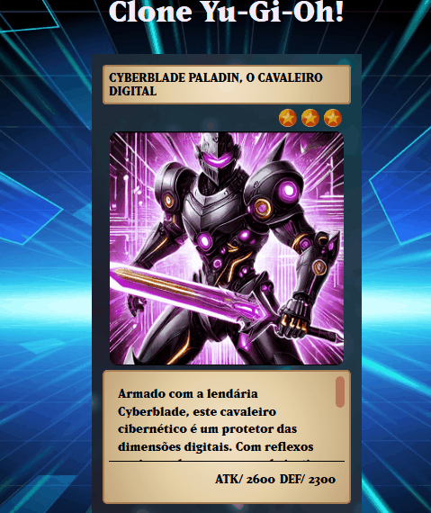

# Projeto com README
Um projeto de teste com arquivo README 🐱‍🏍
[](https://patriciaf-santos.github.io/projeto-clone-Yu-Gi-Oh/)

## Tecnologias utilizadas
- HTML
- CSS
- JS

## Como utilizar 

1- Clone o projeto usando o terminal gitbash
````
git clone <url https://github.com/patriciaf-santos/repositorio-com-readme.git>
````
2- Acesse a pasta do projeto
````
cd repositorio-com-readme/
````
3- Abra com VScode
````
code .
````
